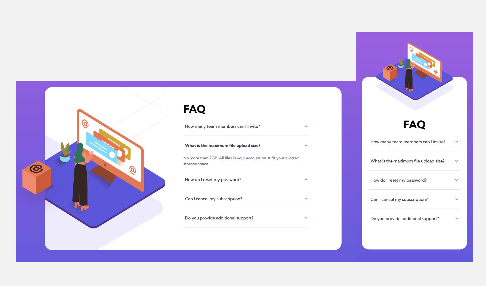

# Frontend Mentor - FAQ accordion card solution

This is a solution to the [FAQ accordion card challenge on Frontend Mentor](https://www.frontendmentor.io/challenges/faq-accordion-card-XlyjD0Oam). Frontend Mentor challenges help you improve your coding skills by building realistic projects.

## Overview

### The challenge

Users should be able to:

- View the optimal layout for the component depending on their device's screen size
- See hover states for all interactive elements on the page
- Hide/Show the answer to a question when the question is clicked

### Screenshot

### Links

- Live Site URL: [Click Here](https://dank1368.github.io/faq_accordion_card/)

## My process

### Built with

- Semantic HTML5 markup
- SASS with partials
- Flexbox
- CSS Grid
- Mobile-first workflow

### What I learned

- Mobile first approach
- Continuing to improve the use of SASS with partials
- Working with the DOM in JS, manipulating elements and inserting classes during click events
- Although I'm not sure if this is the right approach, but since certain elements needed
  to be changed during a click event, while others not, I made use of a filtered array to achieve this.
